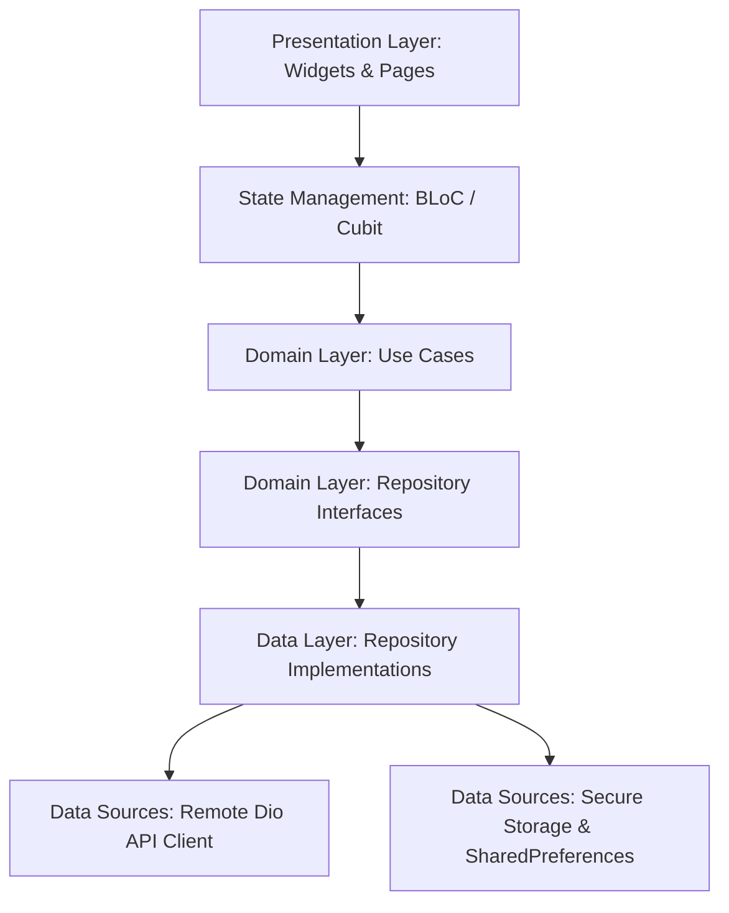

<div align="center">

  # 🏛️ RUYA (رؤية)
  ### *AI-Powered Smart Tourism & Heritage Exploration for Ancient Egypt*

  <p align="center">
    <strong>Reimagining Egypt’s timeless legacy through conversational AI, computer vision, smart ticketing, and real-time geofenced discovery.</strong>
  </p>

  <p align="center">
    <a href="#-key-features"></a>
    <a href="#-key-features"></a>
    <a href="#-architecture"></a>
    <a href="#-internationalization"></a>
    <a href="#-theme-system"></a>
    <a href="#-automated-testing"></a>
  </p>

  <p align="center">
    <a href="#-about-the-project">About</a> •
    <a href="#-key-features">Key Features</a> •
    <a href="#-tech-stack--architecture">Architecture</a> •
    <a href="#-getting-started">Getting Started</a> •
    <a href="#-screenshots--ui-showcase">UI Showcase</a> •
    <a href="#-team">Team</a>
  </p>

  <br />

  

</div>

---

## 🌟 About the Project

**Ruya (رؤية)** is an enterprise-grade, cross-platform mobile application engineered as a graduation project for the **Information Technology Institute (ITI)**. It serves as an intelligent, pocket-sized historical companion for tourists and history enthusiasts exploring Egypt's world-renowned monuments, temples, and archaeological treasures.

By combining modern mobile engineering with state-of-the-art AI, **Ruya** bridges 7,000 years of civilization with modern digital experiences — featuring an interactive voice-enabled AI Tour Guide, automated camera scanner recognition, real-time GPS proximity alerts, paperless ticket reservations, and customized travel journals.

---

## 🚀 Key Features

<table>
  <tr>
    <td width="50%">
      <h3>🏛️ 1. Monument & Site Discovery</h3>
      <ul>
        <li>Interactive catalog of Egyptian archaeological landmarks with rich photo galleries.</li>
        <li>Dynamic multi-category filtering (Pyramids, Temples, Museums, Historical Sites).</li>
        <li>Instant real-time search with live query debounce.</li>
        <li>Full historical narratives, opening hours, pricing breakdown, and Google Maps GPS navigation.</li>
      </ul>
    </td>
    <td width="50%">
      <h3>🤖 2. Conversational AI Tour Guide</h3>
      <ul>
        <li><b>Ruya AI Chatbot</b>: In-depth historical knowledge base answering queries in English and Arabic.</li>
        <li><b>Voice-to-Speech (STT)</b>: Speak queries directly using built-in speech recognition.</li>
        <li><b>Text-to-Speech (TTS)</b>: Listen to historical stories with native voice playback.</li>
        <li>Full session history, query threads, and context management.</li>
      </ul>
    </td>
  </tr>
  <tr>
    <td width="50%">
      <h3>📸 3. AI Camera & Artifact Scanner</h3>
      <ul>
        <li>Real-time camera scanner to identify artifacts and monuments on-the-go.</li>
        <li>Gallery photo upload and instant image analysis.</li>
        <li>Deep-dive metadata cards with historical context, origin period, and dynasty details.</li>
      </ul>
    </td>
    <td width="50%">
      <h3>🎟️ 4. Paperless Ticketing & Digital Pass</h3>
      <ul>
        <li>Streamlined ticket reservation with date selection and counter calculation.</li>
        <li>Unique cryptographic reference codes for instant on-site verification.</li>
        <li><b>Export Pass</b>: 1-click export to high-resolution <b>PDF</b> or photo album image.</li>
        <li>Full offline-first local bookings database.</li>
      </ul>
    </td>
  </tr>
  <tr>
    <td width="50%">
      <h3>📍 5. GPS Proximity & Smart Geofencing</h3>
      <ul>
        <li>Background & foreground proximity tracker notifying users when near historical sites.</li>
        <li>Configurable location permission states with battery-efficient geofencing algorithms.</li>
        <li>On-the-fly site suggestions banner tailored to user coordinates.</li>
      </ul>
    </td>
    <td width="50%">
      <h3>⏰ 6. Smart Visit Reminders</h3>
      <ul>
        <li>Automated push notifications for upcoming booked site visits.</li>
        <li>Intelligent time picker adapting to visit dates and same-day departures.</li>
        <li>Interactive reminder management directly from ticket passes or the <i>My Bookings</i> screen.</li>
      </ul>
    </td>
  </tr>
  <tr>
    <td width="50%">
      <h3>📖 7. Moments & Memory Timeline</h3>
      <ul>
        <li>Personalized travel journal allowing tourists to document their Egyptian trip.</li>
        <li>Attach photos, reflections, dates, and locations to specific monuments.</li>
        <li>Interactive timeline gallery with image editing and moment deletion.</li>
      </ul>
    </td>
    <td width="50%">
      <h3>🌐 8. Bilingual & Dynamic Theme Engine</h3>
      <ul>
        <li><b>Native RTL Support</b>: Full Arabic (العربية) and English localization with instant runtime switcher.</li>
        <li><b>Curated Theme Engine</b>: Sleek Egyptian Sand & Gold Light Theme + High-contrast Obsidian Dark Mode.</li>
        <li>Persistent user preferences backed by secure storage.</li>
      </ul>
    </td>
  </tr>
</table>

---

## 🏗️ Tech Stack & Architecture

Ruya is crafted following **Clean Architecture** principles and **Feature-Driven Development**, ensuring strict separation of concerns, high testability, and enterprise scalability.



### 🧰 Core Dependencies & Libraries

| Category | Technology / Package | Purpose |
|:---|:---|:---|
| **Core Framework** | `Flutter (v3.x)` & `Dart (v3.x)` | Multi-platform UI toolkit |
| **State Management** | `flutter_bloc` / `bloc` | Predictable, reactive state handling |
| **Architecture / DI** | `get_it` | High-performance dependency injection container |
| **Routing** | `go_router` | Declarative URL-based navigation & deep linking |
| **Networking** | `dio` | HTTP client with custom Auth, Language, and Normalised error interceptors |
| **Security & Storage** | `flutter_secure_storage` & `shared_preferences` | Encrypted JWT token vault & app preferences |
| **Localization** | `flutter_localizations` & `intl` | Official ARB-driven bilingual translation (EN / AR + RTL) |
| **AI Voice & Speech** | `speech_to_text` & `flutter_tts` | Real-time speech recognition & audio narration |
| **Location & GPS** | `geolocator` & `permission_handler` | High-accuracy geofencing & proximity site detection |
| **Notifications** | `flutter_local_notifications` & `timezone` | Scheduled local notifications & exact alarm dispatch |
| **Ticketing & Media** | `pdf`, `printing`, `screenshot`, `gal`, `share_plus` | Digital ticket rendering, PDF export, saving to gallery, and sharing |

---

## 📂 Project Directory Structure

```plaintext
ruya/
├── android/                   # Android native configuration & Gradle scripts
├── ios/                       # iOS native configuration & plist manifests
├── web/                       # Web entrypoint & assets
├── assets/                    # Static assets (brand logos, monument images, shaders)
├── lib/
│   ├── core/                  # Shared cross-cutting modules
│   │   ├── config/            # Environment configurations (AppConfig)
│   │   ├── di/                # GetIt Service locator injection container
│   │   ├── error/             # Failure definitions & error normalizers
│   │   ├── localization/      # LocaleCubit & runtime language switch
│   │   ├── location/          # ProximityService, GPS stream & Geofencing
│   │   ├── network/           # DioClient, interceptors & API exception normalizer
│   │   ├── routing/           # AppRouter & GoRoute definitions
│   │   ├── services/          # Local NotificationService & Timezone engine
│   │   ├── session/           # Token vault & User session manager
│   │   ├── theme/             # AppTheme (Light & Dark), Color Tokens, ThemeCubit
│   │   └── utils/             # AppSnackBar, spacing, custom formatters
│   ├── features/              # Feature modules (Clean Architecture)
│   │   ├── auth/              # Sign In, Sign Up, Forgot Password OTP
│   │   ├── booking/           # Ticket selection, Pass generation, PDF/Image export
│   │   ├── camera_scanner/    # AI camera scanner & photo identifier
│   │   ├── chat/              # Ruya AI tour guide, voice input & TTS audio
│   │   ├── home/              # Landmark discovery, filters, GPS alerts
│   │   ├── moments/           # Travel memories & photo timeline journal
│   │   ├── profile/           # User settings, dark mode switch, language switcher
│   │   └── site_details/      # In-depth monument information & itinerary planner
│   ├── l10n/                  # ARB localization files & generated localizations
│   └── main.dart              # App entrypoint & global multi-bloc provider
└── test/                      # Comprehensive unit and widget test suites
```

---

## ⚙️ Getting Started

### 📋 Prerequisites
Ensure you have the following installed on your development machine:
- **Flutter SDK**: `>= 3.12.1` ([Install Guide](https://docs.flutter.dev/get-started/install))
- **Dart SDK**: `>= 3.12.1`
- **Android Studio / Xcode** (for mobile emulators & native toolchains)
- **Java JDK**: Version 17

### 📥 1. Clone the Repository
```bash
git clone https://github.com/Ruya-Graduation/RuyaMobile.git
cd RuyaMobile/ruya
```

### 🔑 2. Environment Configuration
Create a `.env` file in the `ruya/` directory (or copy from `.env.example`):
```env
BASE_URL=https://ruya.runasp.net
```

### 📦 3. Install Dependencies & Generate Code
```bash
# Fetch pub packages
flutter pub get

# Generate bilingual localization files
flutter gen-l10n
```

### 🧪 4. Run Automated Tests
Execute the entire test suite to verify project health:
```bash
flutter test
```

### 📱 5. Launch the Application
```bash
# Run on connected Android / iOS device or Emulator
flutter run

# Run on Web (Chrome)
flutter run -d chrome
```

### 📦 6. Build Standalone Release APK
```bash
flutter build apk --release
```
The output APK will be available at:
`build/app/outputs/flutter-apk/app-release.apk`

---

## 🧪 Quality Assurance & Testing

Ruya is tested with unit and widget test suites covering:
* **State Management**: Complete state transition verification across all Cubits (`ThemeCubit`, `LocaleCubit`, `ChatCubit`, `HomeCubit`, `SiteDetailsCubit`, `VoiceInputCubit`).
* **Network & Interceptors**: Dio language injection, auth token headers, and ASP.NET problem details normalization.
* **Domain & Data**: Offline booking storage, repository error mapping, and model serialization.

```bash
00:04 +50: All tests passed!
```

---

## 🛡️ Security & Reliability

* **Zero-Leak Token Vault**: JWT tokens are encrypted at rest via hardware-backed keystore (`flutter_secure_storage`).
* **Resilient Interceptors**: HTTP headers automatically adapt to runtime locale changes (`Accept-Language: ar|en`).
* **Offline Synchronization**: Bookings and travel memories are preserved locally even without internet connectivity.

---

## 👥 Authors & Acknowledgments

Developed with ❤️ as an **ITI Graduation Project (Intake 44)**.

* **Project Name**: Ruya (رؤية)
* **Organization**: Information Technology Institute (ITI)
* **Target Industry**: Tourism, Cultural Heritage & Artificial Intelligence

---

<div align="center">
  <sub>Built for the future of Egyptian tourism. © 2026 Ruya Team. All rights reserved.</sub>
</div>